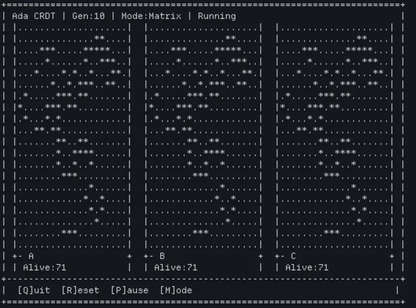

[](https://alire.ada.dev/crates/crdt)


> Logo [under public domain](#credits), we are not affiliated with AdaCore.

# CRDT

CRDT (Conflict-Free Replicated Data Types) library for Ada/SPARK.

Note: The canonical is
[on GitHub](https://github.com/bladeacer/Ada_CRDT). The
[Codeberg repository](https://codeberg.org/bladeacer/ada_crdt) was archived
due to Codeberg TOS changes on AI assisted code. No issues or pull requests
will be accepted there. Submit proposed changes on GitHub instead.

## LLM Usage disclosure

AI assistance was used for this project.

## Install

### Alire Community Index

```bash
alr with crdt
```

[View on Alire Community Index](https://alire.ada.dev/crates/crdt).

### Quick Reference

| Component | Package | API Docs |
|-----------|---------|----------|
| PN-Counter | `CRDT.Pn_Counters` | [docs](docs/api-docs/crdt-pn_counters.md) |
| LWW Set (Lamport, **deprecated**) | `CRDT.Lww_Element_Sets` | [docs](docs/api-docs/crdt-lww_element_sets.md) |
| LWW Set (any clock) | `CRDT.Lww_Sets` | [docs](docs/api-docs/crdt-lww_sets.md) |
| RGA Sequence | `CRDT.Rga` | [docs](docs/api-docs/crdt-rga.md) |
| Clock strategies | `CRDT.Clocks.*` | [docs](docs/api-docs/crdt-clocks.md) |
| State-based sync | `CRDT.Sync.State_Based` | [docs](docs/api-docs/crdt-sync-state_based.md) |
| Op-based sync | `CRDT.Sync.Op_Based` | [docs](docs/api-docs/crdt-sync-op_based.md) |
| Thread-safe wrappers | `CRDT.Protected` | [docs](docs/api-docs/crdt-protected.md) |
| Bounded wrappers | `CRDT.Bounded` | [docs](docs/api-docs/crdt-bounded.md) |
| HLC | `CRDT.HLC` | [docs](docs/api-docs/crdt-hlc.md) |

### Local Index

```bash
alr index --add git+https://github.com/bladeacer/Ada_CRDT.git --name crdt
alr with crdt
```

Then, include `with "crdt";` in your `.gpr` file.

## Development

Clone and build locally:

```bash
git clone https://github.com/bladeacer/Ada_CRDT.git
cd ada_crdt
make build
make run
```

---

## Documentation

Full API reference: [docs/api-docs/index.md](docs/api-docs/index.md)
Generated from docstring annotations via `make doc`. Covers all public
and private entities.

DO-178C compliance artifacts (PSAC, HLR, LLR, traceability):
[docs/compliance/index.md](docs/compliance/index.md).

## Upgrading

See [changelogs](docs/changelogs/index.md) and
[migration guide](docs/changelogs/crdt-1.4.0-migration.md) before bumping
your `alire.toml` dependency. Wire format is auto-detected (V1/V2/V3).

---

## Core Types

### PN-Counter (Actor Map)

Per-replica increments/decrements. Fixed memory (3 replicas = 3 slots),
regardless of op count. See [API docs](docs/api-docs/crdt-pn_counters.md)
for full interface reference.

```ada
with CRDT.Pn_Counters;

A : CRDT.Pn_Counters.PN_Counter (Max_Actors => 5);
B : CRDT.Pn_Counters.PN_Counter (Max_Actors => 5);

CRDT.Pn_Counters.Increment (A, 5, Actor => 1);
CRDT.Pn_Counters.Increment (B, 10, Actor => 2);

CRDT.Pn_Counters.Merge (A, B);  -- value = 15
```

Package: `CRDT.Pn_Counters`

### LWW-Clocked-Set (any clock strategy)

Last-Writer-Wins set parameterised over any clock strategy
(Lamport, Vector, or Matrix). See [API docs](docs/api-docs/crdt-lww_sets.md)
for full interface reference.

```ada
with CRDT.Lww_Sets;
with CRDT.Clocks.Vector;
package V is new CRDT.Clocks.Vector (Max_Replicas => 8);
package S is new CRDT.Lww_Sets (Integer, 100, V.Clock_Time,
  Clk_Kind     => CRDT.Clocks.Clock_Vector,
  ">"          => V.">",
  Max          => V.Max,
  Write_Clock  => V.Write_Clock,
  Read_Clock   => V.Read_Clock);

Set : S.LWW_Clocked_Set (Capacity => 100);
TS  : V.Clock_Time := (others => 0);

S.Add (Set, 42, TS);
S.Add (Set, 99, TS);
S.Remove (Set, 42, TS);
```

Package: `CRDT.Lww_Sets` (generic over any `CRDT.Clocks.*` strategy)

### RGA Sequence

Three backend engines, same API. See [API docs](docs/api-docs/index.md) for
full details.

```ada
with CRDT.Rga;
package Seq is new CRDT.Rga (Character, 100);
use Seq;

A : RGA (Capacity => 100);
B : RGA (Capacity => 100);

Insert (A, 1, (Replica => 1, Seq => 1), 'a');
Insert (A, 2, (Replica => 1, Seq => 2), 'b');
Insert (B, 1, (Replica => 2, Seq => 1), 'x');

Merge (A, B);  -- convergent state

-- Iterate
Pos : Cursor := First (A);
while Has_Element (Pos) loop
   Put (Element (A, Pos));
   Next (A, Pos);
end loop;
```

Package: `CRDT.Rga` (default engine) or `CRDT.Sequences.<Engine>`

### Engine Comparison

| Engine | Package | Design | Trade-off |
|--------|---------|--------|-----------|
| Yjs (default) | `CRDT.Rga` / `CRDT.Sequences.Yjs` | Chunk-based blocks, structural splitting | Fast bulk ops, larger tombstone overhead |
| Naive | `CRDT.Sequences.Naive` | Flat linked-list per element | Simple, O(n) lookups |
| Fugue | `CRDT.Sequences.Fugue` | BST tree with Depth ordering | Anti-interleaving, no GC rebalancing yet |

> It **helps to understand how suitable** each backend is for a given use case.

```ada
-- Switch engine by changing the with line
with CRDT.Sequences.Naive;
package S is new CRDT.Sequences.Naive (Character, 100);
```

### Sync Layer

See [API docs](docs/api-docs/crdt-sync-state_based.md) and
[docs](docs/api-docs/crdt-sync-op_based.md) for full interface reference.

State-based (CvRDT) with delta sync and HLC:

```ada
with CRDT.Sync.State_Based;

Config : Sync_Config := (Max_Replicas => 4, Delta_Sync => True, HLC_Node => 1);
Local  : Replica_State := Create (Config);
Remote : Replica_State := Create (Config);

Merge (Local, Remote);
```

Operation-based (CmRDT) with bounded op log and ack/GC:

```ada
with CRDT.Sync.Op_Based;

Log : Op_Log (Capacity => 1000);

Append (Log, (Kind => Op_Insert, Seq => 1, Node => 1, Position => 1));
Append (Log, (Kind => Op_Delete, Seq => 2, Node => 1, Del_Position => 1));

Acknowledge (Log, Up_To_Seq => 1);  -- mark delivered
Compact (Log);                       -- purge acknowledged ops
```

---

## Wrappers

- **`CRDT.Protected`**: Thread-safe protected-object wrappers (no locking).
- **`CRDT.Bounded`**: Compile-time bounded, zero-heap allocation.

```
with CRDT.Bounded;
package Bnd is new CRDT.Bounded.Bounded_RGA (Character, 100);
R : Bnd.Sequence;
```

---

## Supporting Types

| Package | Role |
|---------|------|
| `CRDT.Core` | `Replica_Id`, `Lamport_Time`, `Protocol_Version`, VTime types |
| `CRDT.HLC` | Hybrid Logical Clock (physical + logical timestamp) |
| `CRDT.Rgas` | Multi-RGA container |

### HLC Example

```ada
with CRDT.HLC;

Clock : CRDT.HLC.Instance := CRDT.HLC.Create (Node => 1);
CRDT.HLC.Tick (Clock);   -- before sending
CRDT.HLC.Recv (Clock, Remote);  -- on receive, reconcile with remote time
```

---

## Wire Protocol

All serialized CRDT state begins with a protocol version byte, detected
automatically on read:

```
V1: [4-byte Natural version][4-byte Total][4-byte Count]...
V2: [LEB128 version=2][LEB128 Total][LEB128 Count]...
V3: [LEB128 version=3][clock_kind byte][LEB128 Total][LEB128 Count]...
```

| Version | Format | Auto-detected |
|---------|--------|---------------|
| V1 (legacy) | Fixed-width `Natural'Read`/`Write` for all fields | Yes (first 4 bytes) |
| V2 (default write) | [LEB128](https://en.wikipedia.org/wiki/LEB128) for all integer fields | Yes (first byte = 2) |
| V3 (clocked) | LEB128 + clock kind discriminator byte | Yes (first byte = 3) |

Legacy types (`LWW_Element_Sets`, `RGA`, `PN_Counters`) continue to write V2
for maximum backward compatibility. New generic types (`Lww_Sets`) write V3
with the appropriate clock strategy identifier.

V1/V2 data can be migrated to V3 via `CRDT.Serialization.Migrate_Header_To_V3`.

### LEB128 Encoding

All `Natural` fields in the wire format use [LEB128](https://en.wikipedia.org/wiki/LEB128)
variable-length encoding (`CRDT.Core.LEB128`), producing 1-5 bytes per value
instead of the fixed 4-byte `Natural'Write`. Small values (common for clocks,
positions, and counts) use 1-2 bytes.

Fields encoded with LEB128:
- Protocol version (1 byte)
- Clock kind byte (V3 only)
- Per-node element count in sets
- Sequence length and replica/sequence ID pairs
- Tombstone and strut counts in RGA chunks

This replaces the earlier fixed-width `Natural'Write` / `Natural'Read` format
(Protocol_Version 1). `Read_RGA` rejects mismatched versions, enabling safe
rolling upgrades.

---

## Building

| Command | Action |
|---------|--------|
| `make build` | Build library + tests |
| `make run` / `make test` | Run test suite (see [test results](test_result.md)) |
| `make prove` | SPARK proofs via `alr gnatprove` |
| `make demo` | Run Conway Game of Life Demo |
| `make doc` | Generate Markdown API docs (See [API docs](docs/api-docs/index.md) |
| `make clean` | Remove build artifacts |

Prerequisites: [Alire](https://alire.ada.dev) (manages GNAT automatically),
[Python 3](https://www.python.org/downloads/) for `make doc`.

---

## Demo



Real-time TUI simulation stress-testing eventual consistency across three
independent nodes. `LWW_Element_Set` for cell state, Yjs RGA for text rows.

```bash
make demo
```

**Controls**: Q Quit, R Reset, P Pause, M Toggle Engine, C Cycle Clock_Kind.

---

## SPARK Proof

Core packages (`CRDT.Core`, `CRDT.Pn_Counters`, `CRDT.Clocks.*`) SPARK-proven
at **Gold** level (Stone + Bronze + Silver + Gold). Current proof stats
auto-generated by `make compliance` -- see `docs/compliance/VERIFICATION.md`.
Generics (Sequences, LWW, RGA) are instantiation-dependent; platform
dependencies (wall clock, RNG, stream I/O) are excluded from formal proof.
Runtime assertions (`-gnata`) provide defensive coverage for generic bodies.

SPARK_Mode coverage (every `SPARK_Mode => Off` location with justification):
[docs/api-docs/crdt-spark-coverage.md](docs/api-docs/crdt-spark-coverage.md).

---

## Credits

Logo:

- [Ada Logo Editor](https://ada-lang-io.github.io/ada-logo-editor/): The Ada Horizon logo
and Aileron Bold font are both released under Creative Common Public Domain (CC0).

Technology Stack:

- [SPARK / Ada 2012](https://www.adacore.com/languages/spark): (AdaCore) language and dialect of choice
- [gnatprove](https://docs.adacore.com/spark2014-docs/html/ug/index.html): (AdaCore) formal verification of source code
- [Alire](https://alire.ada.dev): (AdaCore) Ada/SPARK package manager
- [gnatformat](https://github.com/AdaCore/gnatformat): (AdaCore) code formatter for Ada
- [gnatdoc](https://github.com/AdaCore/gnatdoc): (AdaCore) API documentation generator, interfaces docstrings
with our Python script
- [VT100](https://github.com/darkestkhan/vt100): Minimal Ada VT100 API library

Inspired by:

- PN-Counter: [Apache Cassandra](https://cassandra.apache.org) distributed
counters, [Riak](https://riak.com) CRDTs
- LWW-Element-Set: [Redis Enterprise](https://redis.io),
[SoundCloud Roshi](https://github.com/soundcloud/roshi); Lamport (1978)
- RGA: [Yjs / YATA](https://github.com/yjs/yjs) (Kevin Jahns): block CRDT text editing
- [Automerge](https://github.com/automerge/automerge)
(Martin Kleppmann et al.): JSON CRDT
- [Fugue](https://arxiv.org/abs/2305.00583): tree-based interleaving prevention

Badges:

- [adacovex](https://github.com/bladeacer/adacovex): Ada/SPARK code/proof coverage, SPARK level, DO-178C HAL status tool 

## Contributing

Contributions are welcome! Please read our
[Contributing Guide](./CONTRIBUTING.md) and
[Code of Conduct](./CODE_OF_CONDUCT.md) before opening an issue or pull
request. Use the issue templates in `.github/ISSUE_TEMPLATE/` for bug reports,
feature requests, and security reports.

## License

MIT License.
