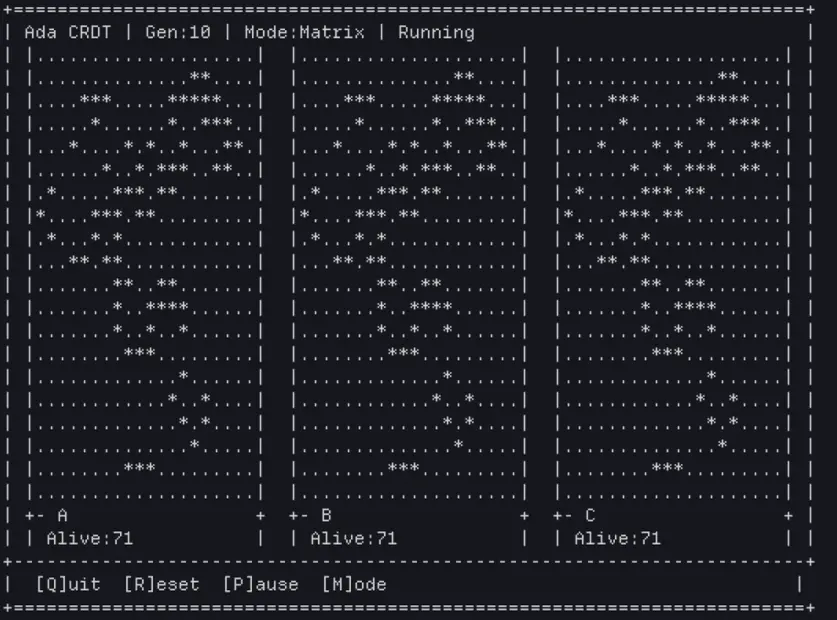

<!-- no-crdt-docs-loc -->
<!-- The project overview: badge set, feature tables, code samples, the
     quick reference generated from the API docs, and the build table. Its
     length is that content, not prose that grew by accident. -->
[](https://alire.ada.dev/crates/crdt)
[](https://ada-crdt.readthedocs.io/en/latest/badges/index.html)
[](https://ada-crdt.readthedocs.io/en/latest/badges/index.html)
[](https://ada-crdt.readthedocs.io/en/latest/compliance/VERIFICATION.html)
[](https://ada-crdt.readthedocs.io/en/latest/badges/index.html)


> The logo is in the public domain (see [Credits](#credits)). We are not affiliated with AdaCore.

# CRDT

CRDT (Conflict-Free Replicated Data Types) library for Ada/SPARK.

The canonical repository is on
[GitHub](https://github.com/bladeacer/Ada_CRDT). The
[Codeberg repository](https://codeberg.org/bladeacer/ada_crdt) was archived
because of Codeberg terms-of-service changes on AI-assisted code. We do not
accept issues or pull requests there. Submit your proposed changes on GitHub
instead.

The documentation is deployed at
[ada-crdt.readthedocs.io](https://ada-crdt.readthedocs.io/en/latest/). The site
carries no tracking script and no cookie, and it shows no paid advertisement
and no flyout menu. Read the
[site transparency page](https://ada-crdt.readthedocs.io/en/latest/site-transparency.html)
for the full statement, including the search box and the hosting provider's
aggregate page-view counting.

## LLM Usage disclosure

AI assistance was used for this project.

## Install

### Alire Community Index

```bash
alr with crdt
```

[View on Alire Community Index](https://alire.ada.dev/crates/crdt).

### Quick Reference

<!-- Generated by tools/gen-quickref.py via make doc. Do not edit by hand. -->

| Component | Package | API Docs |
|-----------|---------|----------|
| PN-Counter | `CRDT.Pn_Counters` | [docs](https://ada-crdt.readthedocs.io/en/latest/api-docs/crdt-pn_counters.html) |
| LWW Set (Lamport, **deprecated**) | `CRDT.Lww_Element_Sets` | [docs](https://ada-crdt.readthedocs.io/en/latest/api-docs/crdt-lww_element_sets.html) |
| LWW Set (any clock) | `CRDT.Lww_Sets` | [docs](https://ada-crdt.readthedocs.io/en/latest/api-docs/crdt-lww_sets.html) |
| RGA Sequence | `CRDT.Rga` | [docs](https://ada-crdt.readthedocs.io/en/latest/api-docs/crdt-rga.html) |
| Clock strategies | `CRDT.Clocks` | [docs](https://ada-crdt.readthedocs.io/en/latest/api-docs/crdt-clocks.html) |
| State-based sync | `CRDT.Sync.State_Based` | [docs](https://ada-crdt.readthedocs.io/en/latest/api-docs/crdt-sync-state_based.html) |
| Op-based sync | `CRDT.Sync.Op_Based` | [docs](https://ada-crdt.readthedocs.io/en/latest/api-docs/crdt-sync-op_based.html) |
| Sequence engines | `CRDT.Sequences` | [docs](https://ada-crdt.readthedocs.io/en/latest/api-docs/crdt-sequences.html) |
| Post-quantum security | `CRDT.Security` | [docs](https://ada-crdt.readthedocs.io/en/latest/api-docs/crdt-security.html) |
| Thread-safe wrappers | `CRDT.Protected` | [docs](https://ada-crdt.readthedocs.io/en/latest/api-docs/crdt-protected.html) |
| Bounded wrappers | `CRDT.Bounded` | [docs](https://ada-crdt.readthedocs.io/en/latest/api-docs/crdt-bounded.html) |
| HLC | `CRDT.HLC` | [docs](https://ada-crdt.readthedocs.io/en/latest/api-docs/crdt-hlc.html) |

### Local Index

```bash
alr index --add git+https://github.com/bladeacer/Ada_CRDT.git --name crdt
alr with crdt
```

Then, include `with "crdt";` in your `.gpr` file.

## Development

Clone and build locally:

```bash
git clone https://github.com/bladeacer/Ada_CRDT.git
cd ada_crdt
make build
make test
```

---

## Documentation

The full index lives at
[ada-crdt.readthedocs.io](https://ada-crdt.readthedocs.io/en/latest/). Highlights:

| Reference | Description |
|-----------|-------------|
| [Usage guide](https://ada-crdt.readthedocs.io/en/latest/usage/index.html) | Self-contained user guide: engines, clocks, sync, serialisation, security |
| [Getting started](https://ada-crdt.readthedocs.io/en/latest/usage/getting-started.html) | Install path, first PN-Counter, LWW set, and sync loop |
| [Sequence engines](https://ada-crdt.readthedocs.io/en/latest/usage/engines.html) | Yjs, Naive, and Fugue engines, and their garbage collection |
| [Engine comparison](https://ada-crdt.readthedocs.io/en/latest/usage/engine-comparison.html) | Engine robustness against upstream Yjs and Automerge |
| [Clock strategies](https://ada-crdt.readthedocs.io/en/latest/usage/clock-strategies.html) | Lamport, Vector, and Matrix clocks, and how to pick a default |
| [Sync layers](https://ada-crdt.readthedocs.io/en/latest/usage/sync.html) | State-based versus operation-based sync, and the op-log lifecycle |
| [Serialisation](https://ada-crdt.readthedocs.io/en/latest/usage/serialization.html) | The V1, V2, and V3 wire formats, and the migration helpers |
| [Security](https://ada-crdt.readthedocs.io/en/latest/usage/security.html) | SHA-256, HMAC, and LMS signature verification |
| [Containers and wrappers](https://ada-crdt.readthedocs.io/en/latest/usage/containers-and-wrappers.html) | Bounded wrappers, protected types, multi-RGA, and the HLC |
| [API reference](https://ada-crdt.readthedocs.io/en/latest/api-docs/index.html) | Auto-generated package docs, public and private entities |
| [SPARK coverage](https://ada-crdt.readthedocs.io/en/latest/api-docs/crdt-spark-coverage.html) | Every `SPARK_Mode => Off` location with its justification |
| [Quality gates](https://ada-crdt.readthedocs.io/en/latest/contributing/quality-gates.html) | Every `make` target and what each gate proves |
| [AI and LLM usage](https://ada-crdt.readthedocs.io/en/latest/contributing/llm-usage.html) | Disclosure, the evidence, and the bar a change must meet |
| [DO-178C compliance](https://ada-crdt.readthedocs.io/en/latest/compliance/index.html) | PSAC, HLR, LLR, traceability, and verification results |
| [Proof records](https://ada-crdt.readthedocs.io/en/latest/proof/index.html) | The verified-condition ledger, and why a unit is skipped |
| [Site transparency](https://ada-crdt.readthedocs.io/en/latest/site-transparency.html) | Search, traffic analytics, advertising, and the flyout menu |
| [Changelog](https://ada-crdt.readthedocs.io/en/latest/changelogs/index.html) | Release history |
| [CI/CD](https://ada-crdt.readthedocs.io/en/latest/ci-cd.html) | The workflows and their local equivalents |

## Badges

The badges above report the current release state, and each badge links to the
page that carries the full data:

| Badge | Source | What it reports |
|-------|--------|-----------------|
| Alire | [the Alire index](https://alire.ada.dev/crates/crdt) | The published crate version on the Alire community index |
| SPARK | [the badges page](https://ada-crdt.readthedocs.io/en/latest/badges/index.html) | The proof level and the verification-condition counts |
| DO-178C | [the badges page](https://ada-crdt.readthedocs.io/en/latest/badges/index.html) | The DAL-C assessment result |
| Tests | [VERIFICATION.md](https://ada-crdt.readthedocs.io/en/latest/compliance/VERIFICATION.html) | The passing test count per category |
| docs | [the badges page](https://ada-crdt.readthedocs.io/en/latest/badges/index.html) | The docstring coverage of the public subprograms |

## Upgrading

See the [changelogs](https://ada-crdt.readthedocs.io/en/latest/changelogs/index.html)
and the [migration guide](https://ada-crdt.readthedocs.io/en/latest/changelogs/crdt-1.4.0-migration.html)
before you bump your `alire.toml` dependency. Wire format is auto-detected
(V1/V2/V3).

---

## Core Types

### PN-Counter (Actor Map)

Per-replica increments/decrements. Fixed memory (3 replicas = 3 slots),
regardless of op count. See [API docs](https://ada-crdt.readthedocs.io/en/latest/api-docs/crdt-pn_counters.html)
for full interface reference.

```ada
with CRDT.Pn_Counters;

A : CRDT.Pn_Counters.PN_Counter (Max_Actors => 5);
B : CRDT.Pn_Counters.PN_Counter (Max_Actors => 5);

CRDT.Pn_Counters.Increment (A, 5, Actor => 1);
CRDT.Pn_Counters.Increment (B, 10, Actor => 2);

CRDT.Pn_Counters.Merge (A, B);  -- value = 15
```

Package: `CRDT.Pn_Counters`

### LWW-Clocked-Set (any clock strategy)

Last-Writer-Wins set parameterised over any clock strategy
(Lamport, Vector, or Matrix). See [API docs](https://ada-crdt.readthedocs.io/en/latest/api-docs/crdt-lww_sets.html)
for full interface reference.

```ada
with CRDT.Lww_Sets;
with CRDT.Clocks.Vector;
package V is new CRDT.Clocks.Vector (Max_Replicas => 8);
package S is new CRDT.Lww_Sets (Integer, 100, V.Clock_Time,
  Clk_Kind     => CRDT.Clocks.Clock_Vector,
  ">"          => V.">",
  Max          => V.Max,
  Write_Clock  => V.Write_Clock,
  Read_Clock   => V.Read_Clock);

Set : S.LWW_Clocked_Set (Capacity => 100);
TS  : V.Clock_Time := (others => 0);

S.Add (Set, 42, TS);
S.Add (Set, 99, TS);
S.Remove (Set, 42, TS);
```

Package: `CRDT.Lww_Sets` (generic over any `CRDT.Clocks.*` strategy)

### RGA Sequence

Three backend engines, same API. See [API docs](https://ada-crdt.readthedocs.io/en/latest/api-docs/index.html) for
full details.

```ada
with CRDT.Rga;
package Seq is new CRDT.Rga (Character, 100);
use Seq;

A : RGA (Capacity => 100);
B : RGA (Capacity => 100);

Insert (A, 1, (Replica => 1, Seq => 1), 'a');
Insert (A, 2, (Replica => 1, Seq => 2), 'b');
Insert (B, 1, (Replica => 2, Seq => 1), 'x');

Merge (A, B);  -- convergent state

-- Iterate
Pos : Cursor := First (A);
while Has_Element (Pos) loop
   Put (Element (A, Pos));
   Next (A, Pos);
end loop;
```

Package: `CRDT.Rga` (default engine) or `CRDT.Sequences.<Engine>`

### Engine Comparison

| Engine | Package | Design | Trade-off |
|--------|---------|--------|-----------|
| Yjs (default) | `CRDT.Rga` / `CRDT.Sequences.Yjs` | Chunk-based blocks, structural splitting | Fast bulk ops, larger tombstone overhead |
| Naive | `CRDT.Sequences.Naive` | Flat linked-list per element | Simple, O(n) lookups |
| Fugue | `CRDT.Sequences.Fugue` | BST tree with Depth ordering | Anti-interleaving, no GC rebalancing yet |

> Understand how suitable each backend is for a given use case.

```ada
-- Switch engine by changing the with line
with CRDT.Sequences.Naive;
package S is new CRDT.Sequences.Naive (Character, 100);
```

### Sync Layer

See [state-based sync](https://ada-crdt.readthedocs.io/en/latest/api-docs/crdt-sync-state_based.html) and
[op-based sync](https://ada-crdt.readthedocs.io/en/latest/api-docs/crdt-sync-op_based.html) for the full interface reference.

State-based (CvRDT) with delta sync and HLC:

```ada
with CRDT.Sync.State_Based;

Config : Sync_Config := (Max_Replicas => 4, Delta_Sync => True, HLC_Node => 1);
Local  : Replica_State := Create (Config);
Remote : Replica_State := Create (Config);

Merge (Local, Remote);
```

Operation-based (CmRDT) with bounded op log and ack/GC:

```ada
with CRDT.Sync.Op_Based;

Log : Op_Log (Capacity => 1000);

Append (Log, (Kind => Op_Insert, Seq => 1, Node => 1, Position => 1));
Append (Log, (Kind => Op_Delete, Seq => 2, Node => 1, Del_Position => 1));

Acknowledge (Log, Up_To_Seq => 1);  -- mark delivered
Compact (Log);                       -- purge acknowledged ops
```

---

## Wrappers

- **`CRDT.Protected`**: Thread-safe protected-object wrappers (no locking).
- **`CRDT.Bounded`**: Compile-time bounded, zero-heap allocation.

```
with CRDT.Bounded;
package Bnd is new CRDT.Bounded.Bounded_RGA (Character, 100);
R : Bnd.Sequence;
```

---

## Supporting Types

| Package | Role |
|---------|------|
| `CRDT.Core` | `Replica_Id`, `Lamport_Time`, `Protocol_Version`, VTime types |
| `CRDT.HLC` | Hybrid Logical Clock (physical + logical timestamp) |
| `CRDT.Rgas` | Multi-RGA container |
| `CRDT.Bounded` | Compile-time bounded wrappers for the containers |
| `CRDT.Protected` | Thread-safe protected types for the containers |

See [containers, wrappers, and the hybrid logical clock](https://ada-crdt.readthedocs.io/en/latest/usage/containers-and-wrappers.html)
for when to use each wrapper.

### HLC Example

```ada
with CRDT.HLC;

Clock : CRDT.HLC.Instance := CRDT.HLC.Create (Node => 1);
CRDT.HLC.Tick (Clock);   -- before sending
CRDT.HLC.Recv (Clock, Remote);  -- on receive, reconcile with remote time
```

---

## Wire Protocol

All serialised CRDT state begins with a protocol version byte. The version is
detected automatically on read.

```
V1: [4-byte Natural version][4-byte Total][4-byte Count]...
V2: [LEB128 version=2][LEB128 Total][LEB128 Count]...
V3: [LEB128 version=3][clock_kind byte][LEB128 Total][LEB128 Count]...
```

| Version | Format | Auto-detected |
|---------|--------|---------------|
| V1 (legacy) | Fixed-width `Natural'Read`/`Write` for all fields | Yes (first 4 bytes) |
| V2 (default write) | [LEB128](https://en.wikipedia.org/wiki/LEB128) for all integer fields | Yes (first byte = 2) |
| V3 (clocked) | LEB128 + clock kind discriminator byte | Yes (first byte = 3) |

Legacy types (`LWW_Element_Sets`, `RGA`, `PN_Counters`) continue to write V2
for maximum backward compatibility. New generic types (`Lww_Sets`) write V3
with the appropriate clock strategy identifier.

V1/V2 data can be migrated to V3 via `CRDT.Serialization.Migrate_Header_To_V3`.

### LEB128 Encoding

All `Natural` fields in the wire format use [LEB128](https://en.wikipedia.org/wiki/LEB128)
variable-length encoding (`CRDT.Core.LEB128`), producing 1-5 bytes per value
instead of the fixed 4-byte `Natural'Write`. Small values (common for clocks,
positions, and counts) use 1-2 bytes.

Fields encoded with LEB128:
- Protocol version (1 byte)
- Clock kind byte (V3 only)
- Per-node element count in sets
- Sequence length and replica/sequence ID pairs
- Tombstone and strut counts in RGA chunks

This replaces the earlier fixed-width `Natural'Write` / `Natural'Read` format
(Protocol_Version 1). `Read_RGA` rejects mismatched versions, enabling safe
rolling upgrades.

---

## Building

| Command | Action |
|---------|--------|
| `make build` | Build library + tests |
| `make check` | Full pre-commit gate: ascii, changelog, links, prose, SPARK coverage, build, tests, proof, coverage, compliance |
| `make test` | Run test suite (see [the test results](https://ada-crdt.readthedocs.io/en/latest/compliance/VERIFICATION.html)) |
| `make docs-check` | Prose gate: paragraph cap, sentence spacing, em dash, Latin abbreviation, line cap |
| `make link-check` | Verify every markdown link and anchor resolves |
| `make prove` | SPARK proofs via `alr gnatprove` |
| `make demo` | Run Conway Game of Life Demo |
| `make doc` | Generate Markdown API docs (see [the API reference](https://ada-crdt.readthedocs.io/en/latest/api-docs/index.html)) |
| `make clean` | Remove build artifacts |

Prerequisites: [Alire](https://alire.ada.dev) (manages GNAT automatically),
[Python 3](https://www.python.org/downloads/) for `make doc`.

---

## Demo



The demo is a real-time TUI simulation. It stress-tests eventual consistency
across three independent nodes. It uses `LWW_Element_Set` for cell state and
Yjs RGA for text rows.

```bash
make demo
```

**Controls**: Q Quit, R Reset, P Pause, M Toggle Engine, C Cycle Clock_Kind.

---

## SPARK Proof

Core packages (`CRDT.Core`, `CRDT.Pn_Counters`, `CRDT.Clocks.*`) are
SPARK-proven at the **Gold** level (Stone + Bronze + Silver + Gold). Current
proof statistics are auto-generated by `make compliance`. See
`docs/compliance/VERIFICATION.md`. Generics (Sequences, LWW, RGA) depend on
their instantiations.

Platform dependencies (wall clock, RNG, stream I/O) are
excluded from formal proof. Runtime assertions (`-gnata`) give defensive
coverage for generic bodies.

SPARK_Mode coverage (every `SPARK_Mode => Off` location with justification):
[the SPARK coverage page](https://ada-crdt.readthedocs.io/en/latest/api-docs/crdt-spark-coverage.html).

---

## Credits

Logo:

- [Ada Logo Editor](https://ada-lang-io.github.io/ada-logo-editor/): The Ada Horizon logo
and Aileron Bold font are both released under Creative Common Public Domain (CC0).

Technology Stack:

- [SPARK / Ada 2012](https://www.adacore.com/languages/spark): (AdaCore) language and dialect of choice
- [gnatprove](https://docs.adacore.com/spark2014-docs/html/ug/index.html): (AdaCore) formal verification of source code
- [Alire](https://alire.ada.dev): (AdaCore) Ada/SPARK package manager
- [gnatformat](https://github.com/AdaCore/gnatformat): (AdaCore) code formatter for Ada
- [gnatdoc](https://github.com/AdaCore/gnatdoc): (AdaCore) API documentation generator, interfaces docstrings
with our Python script
- [VT100](https://github.com/darkestkhan/vt100): Minimal Ada VT100 API library

Inspired by:

- PN-Counter: [Apache Cassandra](https://cassandra.apache.org) distributed
counters, [Riak](https://riak.com) CRDTs
- LWW-Element-Set: [Redis Enterprise](https://redis.io),
[SoundCloud Roshi](https://github.com/soundcloud/roshi); Lamport (1978)
- RGA: [Yjs / YATA](https://github.com/yjs/yjs) (Kevin Jahns): block CRDT text editing
- [Automerge](https://github.com/automerge/automerge)
(Martin Kleppmann et al.): JSON CRDT
- [Fugue](https://arxiv.org/abs/2305.00583): tree-based interleaving prevention

Badges:

- [adacovex](https://github.com/bladeacer/adacovex): Ada/SPARK code/proof coverage, SPARK level, DO-178C HAL status tool 

## Contributing

We welcome contributions. Please read our
[Contributing Guide](./CONTRIBUTING.md) and
[Code of Conduct](./CODE_OF_CONDUCT.md) before you open an issue or pull
request. Use the issue templates in `.github/ISSUE_TEMPLATE/` for bug reports,
feature requests, and security reports.

The [quality gates page](https://ada-crdt.readthedocs.io/en/latest/contributing/quality-gates.html)
lists every `make` target and what each gate proves, and the
[AI and LLM usage page](https://ada-crdt.readthedocs.io/en/latest/contributing/llm-usage.html)
states the disclosure and the bar a generated change must meet.

## License

MIT License.
