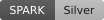
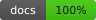

# Badges

This directory holds the SVG badges that the self-assessment renders for the
CRDT library. The readme shows the same set at the top of the page, and
`make prove` regenerates the files from the current assessment.

## Badge set

| File | Badge | Meaning | Current value |
|------|-------|---------|---------------|
| [spark.svg](spark.svg) | SPARK level | The proof level that gnatprove reached for every analysed unit | Platinum |
| [tests.svg](tests.svg) | Tests | The number of tests that pass across all ten categories | 10332 passed |
| [do178c.svg](do178c.svg) | DO-178C | The DAL assessment for the target safety level | DAL-C PASS |
| [iso26262.svg](iso26262.svg) | ISO 26262 | The ASIL assessment, the same evidence under a different name | ASIL B PASS |
| [iec62304.svg](iec62304.svg) | IEC 62304 | The safety-class assessment, the same evidence under a different name | Class A PASS |
| [docs.svg](docs.svg) | Docs | The percentage of documented public subprograms | 100% |

The three standards badges carry the same evidence under three labels. The
project targets DO-178C DAL-C, and the [standards
section](../compliance/index.md) explains the mapping.

## Previews

Each badge renders below, so you can check it before you reference the file.






## How to regenerate

Run the self-assessment through the adacovex tool. The tool resolves the
`covex` development dependency on first use, and `make covex` builds it on
demand:

```bash
make prove
```

`make prove` also refreshes the proof metrics in
[VERIFICATION.md](../compliance/VERIFICATION.md) and the proof level recorded
in the readme, so a badge never carries a number that the verification report
contradicts.

The badge renderer is part of the [adacovex](https://github.com/bladeacer/adacovex)
tool. The badge fields, colours, and shapes are part of that renderer contract.

## Using a badge in your own project

Copy the SVG file into your own repository and link it to the page that carries
the data. A badge that no page explains is an unsupported claim.

```markdown
[](https://ada-crdt.readthedocs.io/en/latest/compliance/VERIFICATION.html)
```

## See also

- [Verification results](../compliance/VERIFICATION.md) -- the proof and test
  numbers behind the badges.
- [SPARK coverage](../api-docs/crdt-spark-coverage.md) -- every
  `SPARK_Mode => Off` location with its justification.
- [Quality gates and make targets](../contributing/quality-gates.md) -- how the
  reports that feed the badges are regenerated.
